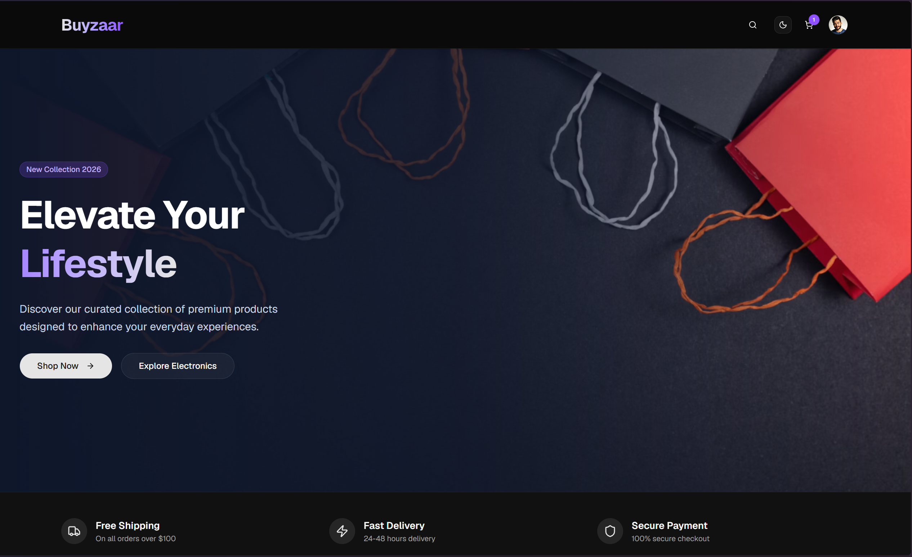
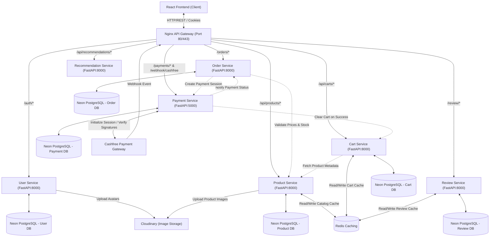
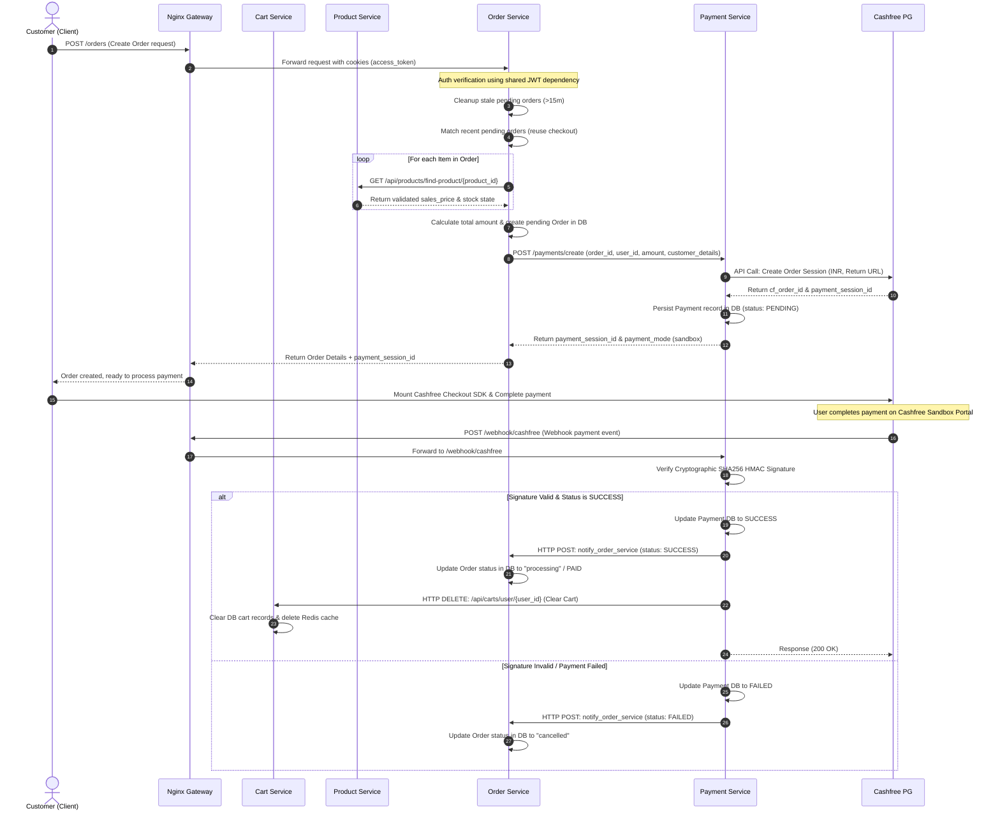

# 🌟 Buyzaar

Buyzaar is an enterprise-grade, high-performance, and highly scalable **distributed microservices e-commerce platform**. The project is designed with a strict **database-per-service** model to ensure complete decoupling, scalability, and independent deployment cycles. 

The platform utilizes an **Nginx API Gateway** as a single entry point for routing, **Redis** for distributed high-speed caching (Cache-Aside pattern), and **Neon Serverless PostgreSQL** for database persistence across all services. The client-side is a feature-rich, modern Single Page Application (SPA) built using React 19, Vite, Tailwind CSS v4, and Shadcn UI.




---

## 📋 Table of Contents
1. [🏗️ System Design & Architecture](#️-system-design--architecture)
2. [🔄 End-to-End System Workflow](#-end-to-end-system-workflow)
3. [⚡ Features](#-features)
4. [🛠️ Technology Stack](#️-technology-stack)
5. [📁 Project Directory Structure](#-project-directory-structure)
6. [🧩 Service Breakdown & Detail](#-service-breakdown--detail)
7. [🛡️ JWT Authentication & Authorization Flow](#️-jwt-authentication--authorization-flow)
8. [🚀 Getting Started](#-getting-started)

---

## 🏗️ System Design & Architecture

Buyzaar implements a modern microservices architecture designed to decouple domain boundaries and scale services independently. Communication between services occurs securely over the internal network using lightweight, asynchronous HTTP REST clients.



### Architectural Key Concepts
1. **API Gateway Pattern**: An Nginx Gateway routes external client traffic to respective services based on path rules. It provides a single IP access point, handles CORS preflight challenges, aggregates paths, and handles SSL/TLS termination.
2. **Database-Per-Service**: To prevent tight coupling, each microservice has its own isolated schema and PostgreSQL database hosted on **Neon Serverless Postgres**. No service ever accesses another service's database directly.
3. **Distributed Caching**: A Redis cache is utilized to speed up catalog queries (Product details, Featured listings), active shopping carts, and reviews. High-frequency read operations bypass Neon DB, saving costs and providing sub-millisecond response times.
4. **Decoupled Integrations**: Image processing (Cloudinary) and Payment settlement (Cashfree) are completely encapsulated inside dedicated service components.

---

## 🔄 End-to-End System Workflow

### The Checkout & Payment Lifecycle
Here is how Buyzaar processes an order from the user's shopping cart through transaction confirmation and state reconciliation:



---

## ⚡ Features

### 🛒 Client & Storefront Features
* **Dynamic Catalog & Search**: Advanced product browsing, filtering by categories, and real-time availability checks.
* **Smart Shopping Cart**: Seamless cart additions, quantity modification checks, total item count calculation, and stock boundary checks.
* **Secure Payment & Checkout**: Seamless integration with **Cashfree Payment Gateway** supporting sandbox credit cards, simulated UPI, NetBanking, and instant transaction responses.
* **Detailed Ratings & Reviews**: User feedback with visual star ratings, average score calculation, and review history per product.
* **Responsive Fluid Design**: Fully responsive layout matching desktop, tablet, and mobile breakpoints using Tailwind CSS v4 and Shadcn UI.
* **Dynamic Theme Toggle**: System-wide dark/light mode transition with automatic theme persistence in localStorage.

### 🛡️ Administrative Controls
* **Admin Dashboard**: Comprehensive operations console including:
  * **Product Management**: Create, read, update, and delete products (Full CRUD) with Cloudinary file uploads.
  * **Order Tracking**: Comprehensive view of created orders, customer details, and payment states.
  * **User Management**: Inspect registered user accounts, avatars, and user roles.

---

## 🛠️ Technology Stack

| Layer | Technologies & Frameworks | Description / Role |
|---|---|---|
| **Frontend** | React 19, TypeScript, Vite, React Router v7, Redux Toolkit, TanStack Query | Client application, global states, optimized routing, and component server-caching. |
| **UI Styling** | Tailwind CSS v4, Shadcn UI, Radix UI, Lucide Icons | Premium aesthetic layout, dark-mode toggle, responsive grids, and custom animations. |
| **API Gateway** | Nginx | Reverse proxy, CORS controller, security headers, routing endpoint mapping. |
| **Backend Services** | Python, FastAPI, SQLAlchemy, Alembic, Uvicorn | Asynchronous endpoint development, migrations, and automatic OpenAPI schema generation. |
| **Data Storage** | Neon Serverless PostgreSQL | Relational transactional storage optimized for cloud scale. |
| **Caching & Session** | Redis | Key-value store for product listings caching and query speedups. |
| **Image Hosting** | Cloudinary | Asset distribution, profile avatars, and product catalog image processing. |
| **Payments** | Cashfree Sandbox SDK | E-Commerce payment session generation, webhook handling, and cryptographic verification. |
| **Orchestration** | Docker, Docker Compose | Service containerization and local infrastructure replication. |

---

## 📁 Project Directory Structure

```
ecommerce-microservices/
├── docker-compose.yml              # Orchestrates local container environments
├── README.md                       # Main project documentation (this file)
├── certs/                          # SSL Certificate configurations for Gateway HTTPS
├── client/                         # Vite + React + TypeScript Frontend
│   ├── Dockerfile                  # Container instructions for client development server
│   ├── package.json                # Frontend dependencies & packages
│   ├── src/                        # Component assets, page routers, and Redux code
│   └── tailwind.config.js          # Styling configurations
└── server/                         # Backend Services and Proxy
    ├── .env                        # Microservice configuration secrets (Neon DBs, Keys)
    ├── gateway/                    
    │   └── nginx.conf              # API Gateway upstream configurations
    ├── shared/                     # Shared Python utilities across services
    │   ├── cloudinary.py           # Cloudinary asset uploader
    │   ├── dependencies.py         # JWT and session authentication helper
    │   └── security.py             # Password hashing and token decoder wrappers
    └── services/                   # Microservice folder boundaries
        ├── user-service/           # User administration & auth endpoints
        ├── product-service/        # Inventory and Redis cache catalog operations
        ├── review-service/         # User feedbacks and reviews DB
        ├── cart-service/           # Active cart memory maps and Redis cache
        ├── order-service/          # Pricing validation, order creation logic
        ├── payment-service/        # Cashfree sessions, signature check, webhooks
        └── recommendation-service/ # Recommendation API (scaffold)
```

---

## 🧩 Service Breakdown & Detail

### 1. Nginx API Gateway
* **Port Mapping**: `80` (HTTP) / `443` (HTTPS)
* **Configuration**: `server/gateway/nginx.conf`
* **Role**: The single point of entry for all incoming traffic. Routes client requests based on path prefixes:
  - `/auth/*` ➔ `user-service:8000` (User registration, login, profile)
  - `/api/products/*` ➔ `product-service:8000` (Product list, details, creation)
  - `/api/carts/*` ➔ `cart-service:8000` (Cart updates, fetch cart, clear cart)
  - `/review/*` ➔ `review-service:8000` (Creating, editing, retrieving product reviews)
  - `/orders/*` ➔ `order-service:8000` (Order placement, callback, tracking)
  - `/payments/*` & `/webhook/cashfree` ➔ `payment-service:5000` (Checkout initialization and webhook)
  - `/api/recommendations/*` ➔ `recommendation-service:8000` (Scaffold)

### 2. User Service
* **Port**: `8000` (Internal)
* **Database**: Neon Postgres (`DATABASE_URL_USER_SERVICE`)
* **Role**: Manages user profiles, credentials, avatars, and roles (`USER` vs `ADMIN`). Encrypts passwords using BCrypt. Generates secure HS256 JWT tokens.

### 3. Product Service
* **Port**: `8000` (Internal)
* **Database**: Neon Postgres (`DATABASE_URL_PRODUCT_SERVICE`)
* **Caching**: Redis
* **Role**: Handles the product catalog, categorizations, inventories, and images. Uses Redis caching for featured lists and individual product lookups. Automatically invalidates caches upon creation/modification/deletion.

### 4. Cart Service
* **Port**: `8000` (Internal)
* **Database**: Neon Postgres (`DATABASE_URL_CART_SERVICE`)
* **Caching**: Redis
* **Role**: Manages active user baskets. Caches cart data (`cart:{user_id}`) in Redis for quick access. Communicates with Product Service via HTTP to merge real-time product prices and metadata before presenting the cart to the user.

### 5. Review Service
* **Port**: `8000` (Internal)
* **Database**: Neon Postgres (`DATABASE_URL_REVIEW_SERVICE`)
* **Caching**: Redis
* **Role**: Handles comments and rating submissions. Computes average star scores and breakdown counts. Clears review lists cache (`reviews:{product_id}:*`) and rating cache (`rating:{product_id}`) on database updates.

### 6. Order Service
* **Port**: `8000` (Internal)
* **Database**: Neon Postgres (`DATABASE_URL_ORDER_SERVICE`)
* **Role**: Processes checkout requests. Performs price check verification with Product Service to prevent customer tampering, reserves inventory, creates pending orders, and triggers checkout generation by calling Payment Service.

### 7. Payment Service
* **Port**: `5000` (Internal)
* **Database**: Neon Postgres (`DATABASE_URL_PAYMENT_SERVICE`)
* **Role**: Handles Cashfree integration. Initiates sessions, captures payment histories, receives Cashfree webhook notifications, cryptographically verifies signatures using SHA256, notifies Order Service of successes/failures, and triggers Cart Service to empty purchased carts.

### 8. Recommendation Service
* **Port**: `8000` (Internal)
* **Database**: Neon Postgres (`DATABASE_URL_RECOMMENDATION_SERVICE`)
* **Role**: Scaffold API ready for personalization/recommendation integrations.

---

## 🛡️ JWT Authentication & Authorization Flow

Buyzaar implements stateless token-based authorization via secure cookies.

```
[ Client ] --(1. Login/Register Form)--> [ Gateway ] --> [ User Service ]
[ Client ] <--(2. Sets Secure HttpOnly Cookie)-- [ Gateway ] <-- (JWT Token Created)

[ Client ] --(3. Subsequent Request: cart/order)--> [ Gateway ] --> [ Other Services ]
                                                                          |
                                                                  (Shared Dependency decodes
                                                                   JWT and extracts Identity)
```

1. **Token Generation**: Upon successful login or registration, the **User Service** issues a JSON Web Token (JWT) containing the user's `email`, `role`, and `id` (as `sub` and payload keys).
2. **Secure Transport**: The token is returned in the response header setting a cookie named `access_token`. 
   - Cookie Parameters: `httponly=True`, `secure=True`, `samesite="none"`, `max_age=15 days`.
   - Security: Being `HttpOnly`, Javascript code running on the client cannot read the token, neutralizing Cross-Site Scripting (XSS) extraction attacks.
3. **Shared Authentication**: Protected backend endpoints do not need to query the User Service or its database to authenticate requests. Instead, they use a **Shared Dependency** (`server/shared/dependencies.py`):
   - Reads the cookie `access_token` (or fallback header `Authorization: Bearer <token>`).
   - Decodes the token using the shared `JWT_SECRET_KEY` via `jose` library.
   - Extracts identity schema (`TokenData` containing `email`, `role`, `user_id`).
   - Rejects with `HTTP 401 Unauthorized` if the token is invalid, malformed, or expired.
4. **Role-Based Authorization**: Endpoints utilize `TokenData.role` to restrict administrator actions. For example, only `ADMIN` roles are permitted to access `POST`, `PUT`, or `DELETE` routes on the Product Service.

---

## 🚀 Getting Started

### Prerequisites
Ensure you have the following installed on your machine:
* **Docker & Docker Compose** (Highly recommended)
* **Node.js 18+** (For local frontend compilation)
* **Python 3.8+** (For local service debugging)

### 🐋 Option 1: Running with Docker Compose (Recommended)

To run the API Gateway, Redis caching, all 7 microservices, and the React frontend client in a unified container environment, execute the following command from the root directory:

```bash
docker-compose up -d --build
```

#### Access Endpoints
* **Frontend Web App**: [http://localhost:5173](http://localhost:5173)
* **API Gateway Entry**: [http://localhost](http://localhost)
* **Interactive API Docs (Swagger OpenAPI)**:
  - User Service Docs: `http://localhost/auth/docs`
  - Product Service Docs: `http://localhost/api/products/docs`
  - Cart Service Docs: `http://localhost/api/carts/docs`
  - Order Service Docs: `http://localhost/orders/docs`
  - Payment Service Docs: `http://localhost/payments/docs`
  - Review Service Docs: `http://localhost/review/docs`

---

### 💻 Option 2: Running Services Locally (For Development)

If you are modifying individual services, running them locally without Docker provides fast hot-reloading.

#### 1. Setup Backend Environment Configuration
Create a `.env` file inside the `server/` directory following this template:

```env
# Neon Postgres Service Database Connections
DATABASE_URL_USER_SERVICE="postgresql://..."
DATABASE_URL_PRODUCT_SERVICE="postgresql://..."
DATABASE_URL_CART_SERVICE="postgresql://..."
DATABASE_URL_REVIEW_SERVICE="postgresql://..."
DATABASE_URL_ORDER_SERVICE="postgresql://..."
DATABASE_URL_PAYMENT_SERVICE="postgresql://..."
DATABASE_URL_RECOMMENDATION_SERVICE="postgresql://..."

# Security Secret
JWT_SECRET_KEY="your_secure_random_hash_key"

# Cloudinary Integration
CLOUDINARY_CLOUD_NAME="your_cloudinary_cloud_name"
CLOUDINARY_API_KEY="your_cloudinary_api_key"
CLOUDINARY_API_SECRET="your_cloudinary_api_secret"

# Service Host URLs (Development Fallbacks)
USER_SERVICE_URL=http://localhost:8000
PRODUCT_SERVICE_URL=http://localhost:8001
CART_SERVICE_URL=http://localhost:8002
REVIEW_SERVICE_URL=http://localhost:8003
ORDER_SERVICE_URL=http://localhost:8004
PAYMENT_SERVICE_URL=http://localhost:5000

# Cashfree Integrations
CASHFREE_APP_ID="your_cashfree_sandbox_app_id"
CASHFREE_SECRET_KEY="your_cashfree_sandbox_secret_key"
CASHFREE_BASE_URL="https://sandbox.cashfree.com/pg"
CASHFREE_API_VERSION="2023-08-01"
```

#### 2. Run Backend Services (Example: Product Service)
Create a Python virtual environment and run Uvicorn:

```bash
# Navigate to service directory
cd server/services/product-service

# Create and activate virtual environment
python -m venv .venv
source .venv/bin/activate  # Windows: .venv\Scripts\activate

# Install requirements
pip install -r requirements.txt

# Run server with live reload
uvicorn app.main:app --host 0.0.0.0 --port 8001 --reload
```

#### 3. Run Database Migrations (e.g. Payment Service)
Certain services require applying migrations locally:

```bash
cd server/services/payment-service
source .venv/bin/activate  # Active virtual env with dependencies
alembic upgrade head
```

#### 4. Run the Client Web App
Install frontend dependencies and start Vite:

```bash
cd client
npm install
npm run dev
```
Open [http://localhost:5173](http://localhost:5173) in your browser.
